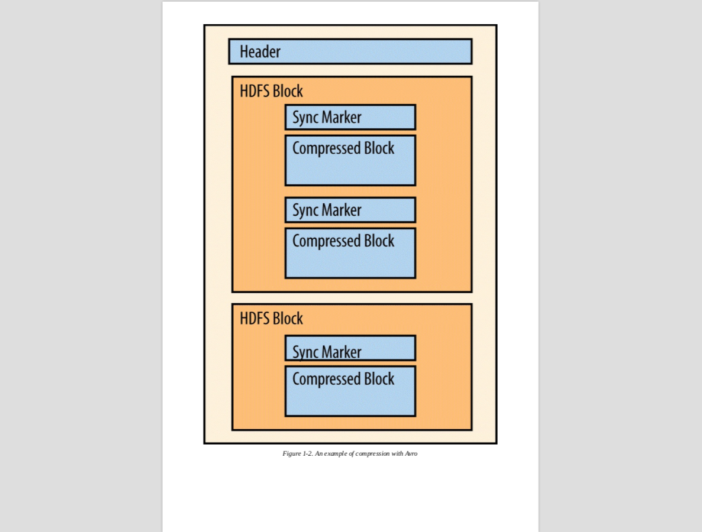

The power of context in Hadoop: "Schema-on-Read", compares to "Schema-on-Write":
- the structure imposed at processing time based on the requirements
- shorter cycles of analysis, data modeling, ETL, testing, etc. before data can be processed
- agility on schema revolutions

Considerations perspectives of storing:
- Data storage formats
- Multitenancy
- Schema Design
- Metadata Management

Beyond the scope:
- [Hadoop Security](http://bit.ly/hadoop-security)

## Data Storage Options

- File format
- Compression
- Data storage system

### Standard File Formats

#### Text data

- ex. server logs, emails, CSV files
- with "splittable" compression, for parallel processing
  - container format: SequenceFiles, Avro

#### Structured text data

- ex. XML, JSON
- challenging to make XML or JSON splittable
  - using container format such as Avro
  - `XMLLoader` in `PiggyBank` library
  - `LzoJaonInputFormat` in `Elephant Bird` project

#### Binary data

- ex. images
- in most of cases, container format is preferred
- in the cases the binary data is larger than a certain size, ex. 64MB, consider not using container format.

### Hadoop File Types

Important characteristics:
- Splittable Compression
  - parallel processing
  - data locality
- Agnostic Compression
  - codec in header metadata

#### File-based data structures

- ex. SequenceFiles, MapFiles, SetFiles, ArrayFiles, and BloomMapFiles
- MapReduce specific
- SequenceFiles
  - most common
  - binary key-value pair
  - formats:
    - uncompressed
    - record-compressed (single record)
    - block-compressed (batch, "not" HDFS block)
  - sync maker
    - to allow for seeking

### Serialization Formats

byte stream <=> data structures

Term:
- **IDL** (Interface Definition Language)
- **RPC** (Remote Procedure Calls)

| Format | Summary | Limitation |
|---|---|---|
| Writables | - simple, efficient, serializable | Only in Hadoop & Java |
| Thrift | - language-natrual   - by Facebook   - use IDL   -robust RPC | - no internal compression of records   - not splittable   - not native MapReduce support   (addressed by Elephant Bird) |
| Protocol Buffers | - language-natrual   - by Google   - use IDL, stub code generation | same as Thrift |
| Avro | - language-natrual   - optional IDL: JSON, C-like   - native support for MapReduce   - compressible: Snappy, Deflate   - splittable: sync marker   - self-decribing: schema in each file header's metadata |

Additional refer: http://blog.maxkit.com.tw/2017/10/thrift-protobuf-avro.html

### Columnar Formats

- skip I/O and decompression
- efficient columnar compression rate

Term:
- **RCFile** (Record Columnar File)
- **ORC** (Optimized Row Columnar)
- **RLE** (bit-packaging/run length encoding)

| Format | Summary | Limitation |
|---|---|---|
| RCFile | column-oriented storage within each row splits | has some deficiencies that prevent optimal performance for query times and compression   (what's this exactly?) |
| ORC | - lightweight, always-on compression   - zlib, LZO, Snappy   - predicate push down   - Hive type, including decimal, complex   - splittable | - only designed for Hive, not general purpose |
| Parquet | - per-column level compression   - support nested data structure   - full metadata, self-documenting   - fully support Avro, Thrift API   - efficient and extensible encoding schemas, RLE |  |

##### Avro and Parquet

- single interface: recommended if you are choosing for the single interface
- compatibility: Parquet can be read and written to with Avro APIs and Avro schemas

### Compression

- disk & network I/O
- source & intermediate data
- trade with CPU loading
- splittability for parallelism and data locality

| Format | Summary | Limitation |
|---|---|---|
| Snappy | - developed at Google   - high speed and reasonable compression rate | - not inherently splittable   - intended to be used with a container format |
| LZO | - very efficient decompression   - splittable | - requires additional indexing   - requires a separated installation from Hadoop because of license prevention |
| Gzip | - good compression rate, 2.5x to Snappy   - read almost as fast as Snappy | - write speed about half to Snappy   - not splittable   - fewer blocks might lead to lower parallelism => using smaller blocks |
| bzip2 | - excellent compression rate, 9% better than Gzip | - slow read / write, 10x slower than Gzip   - only used in archival purposes |

#### Compression Recommendation

- Enable compression of the MapReduce intermediate data
- Compress on columnar chunks
- With splittable container formats, ex. Avro or SequenceFiles, make the compression & decompression could be processed individually

